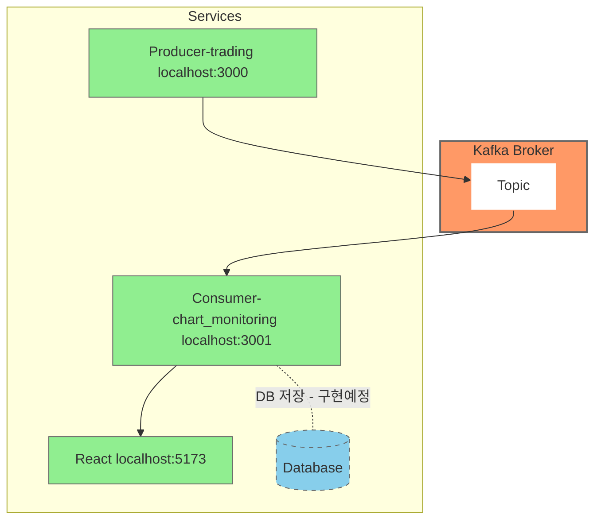

# Nest-Kafka-React

nest서버2 (Producer and Consumer) & React 의 예시코드입니다. 

kafka를 통해 nest간 데이터를 교환하고 websocket을 활용하여 FE와 통신합니다.

프로젝트의 구조는 다음과 같습니다.

```mermaid
flowchart TD
  subgraph Kafka[Kafka Broker]
    topic[Topic]
  end

  subgraph Services
    producer[Producer-trading localhost:3000]
    consumer[Consumer-chart_monitoring localhost:3001]
    frontend[React localhost:5173]
    db[(Database)]
  end

%% Current data flow
  producer --> topic
  topic --> consumer
  consumer --> frontend

%% Future DB implementation
  consumer -.-|DB 저장 - 구현예정|db

%% Styling with universal colors
  classDef kafkaStyle fill:#ff9966,stroke:#666,stroke-width:2px,color:#333
  classDef serviceStyle fill:#90EE90,stroke:#666,color:#333
  classDef topicStyle fill:#FFF,stroke:#ff9966,color:#333
  classDef dbStyle fill:#87CEEB,stroke:#666,stroke-dasharray: 5 5,color:#333

  class Kafka kafkaStyle
  class producer,consumer,frontend serviceStyle
  class topic topicStyle
  class db dbStyle
```